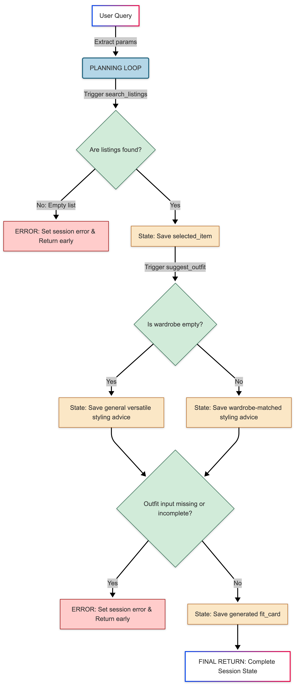

# FitFindr — planning.md

> Complete this document before writing any implementation code.
> Your spec and agent diagram are what you'll use to direct AI tools (Claude, Copilot, etc.) to generate your implementation — the more specific they are, the more useful the generated code will be.
> Your planning.md will be reviewed as part of your submission.
> Update it before starting any stretch features.

---

## Tools

List every tool your agent will use. For each tool, fill in all four fields.
You must have at least 3 tools. The three required tools are listed — add any additional tools below them.

### Tool 1: search_listings

**What it does:**
The ```search_listings``` tool filters a mock inventory dataset based on a user's natural language style keywords, clothing size, and budget limits. It returns a list of matching secondhand items sorted by relevance, or gracefully outputs an empty list if no matches are found.

**Input parameters:**
<!-- List each parameter, its type, and what it represents -->
- `description (str)`: The keywords or item type the user is looking for (e.g., "vintage graphic tee")
- `size (str)`: The user's clothing size (e.g., "M") can be None if they dont specify one
- `max_price (float)`: The maximum budget amount (e.g., 30.0)

**What it returns:**
<!-- Describe the return value — what fields does a result contain? -->
returns a list of dictionary objects (list[dict]) representing the individual secondhand items found in the dataset that matched the search filters. 

if matches are found: it returns a list of dictionaries, sorted by relevance (highest keyword-overlap score first), where each dictionary contains all the specific details for a piece of clothing: `id`, `title`, `description`, `category`, `style_tags` (list), `size`, `condition`, `price` (float), `colors` (list), `brand` (str or None), and `platform`.

**Relevance scoring:** each keyword from `description` that appears anywhere in the listing's searchable text (title, description, category, style_tags, brand) adds to the score; matches in `style_tags` and `title` are weighted higher since they are the strongest relevance signals. Listings with a score of 0 are dropped before sorting.

**What happens if it fails or returns nothing:**
<!-- What should the agent do if no listings match? -->
if ```search_listings``` tool fails or returns nothing, the agent must not fail silently or crash.

from the planning loop logic produces an early termination instead of continuing to the next steps, the planning loop must catch the empty list and short-circuit. 

Check the output: the planning loop evaluates the result. if ```len(results) == 0 ``` (which is an empty list []), it triggers the error path. 

bypass subsequent tools: The agent completely skips calling ```suggest_outfit``` and ```create_fit_card```. It is a strict rule that the agent should not call these tools with empty inputs.

The agent's must update the session state with a clear error message and communicate gracefully with the user. Instead of showing a technical error, it should give actionable feedback so the user knows hwo to fix their query. 

---

### Tool 2: suggest_outfit

**What it does:**
The `suggest_outfit` tool takes a searched item and the user’s current wardrobe data to generate one or more complete outfit combinations. It provides styling advice and handles edge cases gracefully, such as when the user's wardrobe is empty or minimal.

**Input parameters:**
<!-- List each parameter, its type, and what it represents -->
- `new_item (dict)`: this represents the single secondhand clothing item that was successfully found and selected by the agent in step 1 (`search_listings`), it contains all the specific metadata for that piece of clothing so the LLM knows what its styling. 
- `wardrobe (dict)`: this reprensets the use's existing collection of clothes that they already own. The tool used this data to see what items are available to pair with the `new_item`. it follows the structure defined in `data/wardrobe_schema.json ` the key fields inside this dict include, an `items` key, which holds a list of dictionaries, each representing a piece of clothing currently in their closet. 

**What it returns:**
<!-- Describe the return value -->
returns a `string(str)` containing the styling advice and outfit combinations generated by the LLM. It outputs a natural language description of how to style the items. the string must contain an outfit combination, one or more clear suggestions detailing which specific pieces from the user's wardrobe should be paired with the newly found item. and styling advice with practical tips on how to wear the outfit (e.g,how to tuck the shirt, rolling up sleeves, or choosing accessories). 

**What happens if it fails or returns nothing:**
<!-- What should the agent do if the wardrobe is empty or no outfit can be suggested? -->
if `wardrobe["items"]` is empty, the tool must not crash. Instead, it should return a string providing general styling advice for that type of item

---

### Tool 3: create_fit_card

**What it does:**
<!-- Describe what this tool does in 1–2 sentences -->
The `create_fit_card` tool takes the generated outfit suggestion and the newly searched item to produce a short, engaging, and shareable social media-style description (like an Instagram caption). It uses the LLM to ensure the output is creative, highly unique, and varies significantly with each run.

**Input parameters:**
<!-- List each parameter, its type, and what it represents -->
- `outfit (str)`: this is the raw, natural styling advice generated by the tool 2 (`suggest_outfit`) 
- `new_item (dict)`: this is the same dictionary reprenseting the secondahand item found in tool 1 (`search_listings`). 

**What it returns:**
<!-- Describe the return value -->
After taking the text advice and the item data, `create_fit_card` returns a `string (str)` containing a creative, shareable social media-style caption (like an Instagram caption). it needs to look like a real person wrote it. 

**What happens if it fails or returns nothing:**
<!-- What should the agent do if the outfit data is incomplete? -->
The tool should guard against an empty input string and return a helpful, fallback error message string (e.g., "Could not generate a fit card because no outfit suggestion was provided.") rather than letting the Python application crash.

---

### Additional Tools (if any)

<!-- Copy the block above for any tools beyond the required three -->

---

## Planning Loop

**How does your agent decide which tool to call next?**
<!-- Describe the logic your planning loop uses. What does it look at? What conditions change its behavior? How does it know when it's done? -->

The planning loop runs the three tools in a fixed sequence, but it inspects the `session` dictionary after each step to decide whether to continue or short-circuit. It is a state-driven pipeline, not a free-form decision agent.

1. **Search step.** The loop always starts by calling `search_listings(description, size, max_price)` with the parameters parsed from the user query. It reads the returned list and checks `len(results)`.
   - If `len(results) == 0`, it writes a descriptive message to `session["error"]` and **halts** — it does NOT call `suggest_outfit` or `create_fit_card`. This is the strict empty-input rule.
   - Otherwise it isolates the top match (`results[0]`) into `session["selected_item"]` and continues.

2. **Suggest step.** With a valid `selected_item`, the loop calls `suggest_outfit(selected_item, wardrobe)` and stores the returned string in `session["outfit_suggestion"]`. An empty wardrobe is not an error — the tool falls back to general styling advice, so the loop always continues from here.

3. **Fit-card step.** The loop calls `create_fit_card(outfit_suggestion, selected_item)` and stores the result in `session["fit_card"]`.

**How it knows it's done:** the loop finishes when `session["fit_card"]` is populated (success path) or when `session["error"]` is set (early-termination path). The final response shown to the user is built from whichever of those two keys is present.

**Query parsing (Step 2):** the loop parses the raw query into `description`, `size`, and `max_price` using regex / string matching — no extra LLM call. A number is only read as `max_price` when it carries a price signal (a keyword like `under`/`below`/`max`/`cheaper than`, or a `$` sign), so "90s" or "Levi 501" aren't mistaken for a budget. Size accepts `size M` / `size 32` (letter or numeric) plus a standalone letter-token fallback; the remaining text becomes the description. This keeps parsing deterministic, free, and testable.

---

## State Management

**How does information from one tool get passed to the next?**
<!-- Describe how your agent stores and accesses state within a session. What data is tracked? How is it passed between tool calls? -->
the agent tracks the entire lifecycle of the user's request by storing and accessing state within a centralized python dictionary (session). Instead of the individual tools passing data directly to one another, they remain completely isolated. The central planning loop acts as the mediator, reading information from the session dictionary to pas into a tool, and then saving the tool's output back into that same dictionary. 

What data is tracked? 
The session dictionary tracks the data across the multi-step workflow. 
- `session["selected_item"]`:  stores the single item dictionary (containing fields like title, price, size) extracted as the top result from `search_listings`
- `session["outfit_sugestion]`: stores the raw text string returned by `suggest_outfit` detailing how to style the item with the user's wardrobe
- `session["fit_card"]`: stores the final, creative social media caption string returned by `created_fit_card`
- `session["error"]`: stores a decriptive error string if a tool fails or if `search_listings` return an empty list, allowing the loop to halt early. 

                  ┌──────────────────────┐
                  │  User Query/Request  │
                  └──────────┬───────────┘
                             │
                             ▼
                    search_listings()
                             │
                             ▼ (Saves to state)
               session["selected_item"]
                             │
                             ▼ (Passed as input)
                     suggest_outfit()
                             │
                             ▼ (Saves to state)
             session["outfit_suggestion"]
                             │
                             ▼ (Passed as input)
                    create_fit_card()
                             │
                             ▼ (Saves to state)
                  session["fit_card"]

1. From Search to Suggestion: `search_listings` returns a list of items. The planning loop isolates the top match and saves it to `session["selected_item"]`. When calling `suggest_outfit`, the loop reads `session["selected_item"]` and passes it directly into the tool parameters.

2. From Suggestion to Fit Card: The resulting text from `suggest_outfit` is saved into `session["outfit_suggestion"]`. The planning loop then retrieves both `session["outfit_suggestion"]` and the original `session["selected_item"]` from the state and inputs them together into create_fit_card.


---

## Error Handling

For each tool, describe the specific failure mode you're handling and what the agent does in response.

| Tool | Failure mode | Agent response |
|------|-------------|----------------|
| search_listings | No results match the query |The agent then responds by communicating the failure to the user and suggesting an actionable workaround, such as telling them to adjust or widen their size and budget constraints. |
| suggest_outfit | Wardrobe is empty |Instead of a failure message, the tool falls back to generating general, versatile styling advice for the selected item |
| create_fit_card | Outfit input is missing or incomplete |halts execution to inform the user that it could not generate a fit card because no outfit styling suggestion was provided. |

---

## Architecture

<!-- Draw a diagram of your agent showing how the components connect:
     User input → Planning Loop → Tools (search_listings, suggest_outfit, create_fit_card)
                                                                          ↕
                                                                   State / Session
     Show what triggers each tool, how state flows between them, and where error paths branch off.
     ASCII art, a Mermaid diagram (https://mermaid.js.org/syntax/flowchart.html), or an embedded
     sketch are all fine. You'll share this diagram with an AI tool when asking it to implement
     the planning loop and each individual tool. -->



---

## AI Tool Plan

<!-- For each part of the implementation below, describe:
     - Which AI tool you plan to use (Claude, Copilot, ChatGPT, etc.)
     - What you'll give it as input (which sections of this planning.md, your agent diagram)
     - What you expect it to produce
     - How you'll verify the output matches your spec before moving on

     "I'll use AI to help me code" is not a plan.
     "I'll give Claude my Tool 1 spec (inputs, return value, failure mode) and ask it to implement
     search_listings() using load_listings() from the data loader — then test it against 3 queries
     before trusting it" is a plan. -->

**Milestone 3 — Individual tool implementations:**

- **Tool used:** Claude (Claude Code in VS Code).
- **Input given:** the Tool 1 spec from this planning.md (inputs, return value, scoring rule, failure mode), the `tools.py` docstring/TODO, and the real shape of `data/listings.json` plus `load_listings()` from `utils/data_loader.py`.
- **Expected output:** a `search_listings()` that filters by `size` (case-insensitive substring so "M" matches "S/M") and `max_price` (inclusive), scores by keyword overlap with style_tags/title weighted higher, drops 0-score listings, sorts by score, and returns `[]` (never raises) on no match.
- **Verification:** ran 4 queries before trusting it — the planning.md example ("vintage graphic tee", size M, ≤$30) returned 8 relevant items with the Y2K tee ranked first; "baggy denim jeans" surfaced the Baggy Carpenter Jeans first; an impossible query ("astronaut spacesuit" ≤$5) returned `[]` with no crash; the price filter correctly excluded over-budget items.
- `suggest_outfit` and `create_fit_card` will follow the same loop: hand Claude that tool's spec section + docstring, then test the empty-wardrobe / empty-outfit fallback paths explicitly before wiring into the agent.

**Milestone 4 — Planning loop and state management:**

- **Tool used:** Claude.
- **Input given:** the Planning Loop, State Management, and Error Handling sections of this planning.md plus the architecture diagram, and the existing `agent.py` scaffold.
- **Expected output:** a loop that drives the three tools through the `session` dict (`selected_item` → `outfit_suggestion` → `fit_card`), short-circuits to `session["error"]` when `search_listings` returns `[]`, and never calls a downstream tool with empty input.
- **Verification:** test both paths end to end — a happy-path query that produces a fit card, and an empty-result query that halts after search and shows the actionable error message to the user without calling the LLM tools.

---

## A Complete Interaction (Step by Step)

Write out what a full user interaction looks like from start to finish — tool call by tool call. Use a specific example query.

**Example user query:** "I'm looking for a vintage graphic tee under $30. I mostly wear baggy jeans and chunky sneakers. What's out there and how would I style it?"

**Step 1:**
The agent parses the query into search parameters — `description="vintage graphic tee"`, `size="M"` (or None if unstated), `max_price=30.0` — and calls `search_listings("vintage graphic tee", size="M", max_price=30.0)`. The tool filters the 40 listings by size and price, scores the rest by keyword overlap, and returns a sorted list. The loop checks `len(results)`: it's non-empty, so it saves the top match to `session["selected_item"]` (e.g. `lst_002`, the Y2K Baby Tee — Butterfly Print, $18, size S/M) and continues.

**Step 2:**
The loop reads `session["selected_item"]` and the user's `wardrobe` (the baggy jeans + chunky sneakers they mentioned, loaded from the wardrobe data) and calls `suggest_outfit(selected_item, wardrobe)`. The LLM returns styling advice pairing the tee with the user's baggy jeans and chunky sneakers. The loop stores that string in `session["outfit_suggestion"]`.

**Step 3:**
The loop retrieves both `session["outfit_suggestion"]` and `session["selected_item"]` and calls `create_fit_card(outfit_suggestion, selected_item)`. The LLM returns a short, casual caption mentioning the item name, $18 price, and platform (depop). The loop stores it in `session["fit_card"]` — `fit_card` is now populated, so the loop is done.

**Final output to user:**
The user sees the matched item (title, price, size, condition, platform), the outfit suggestion describing how to style it with their baggy jeans and chunky sneakers, and the shareable fit-card caption. If `search_listings` had returned `[]` instead, the user would instead see the `session["error"]` message asking them to widen their size or budget — and the two LLM tools would never have run.
